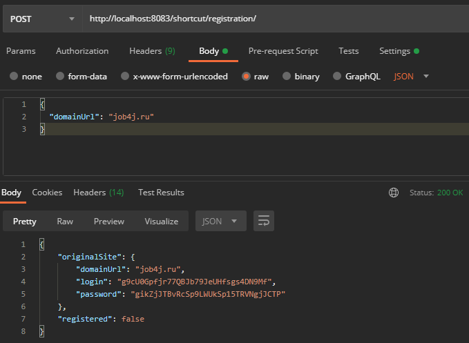
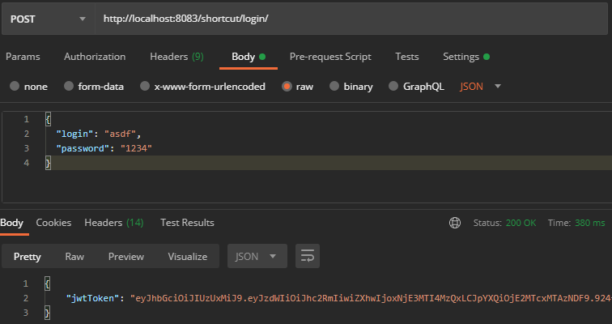
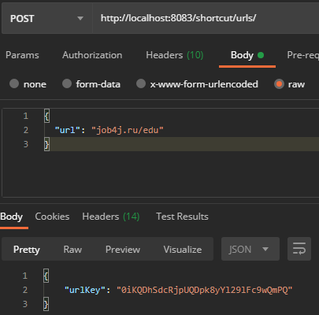
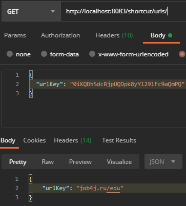
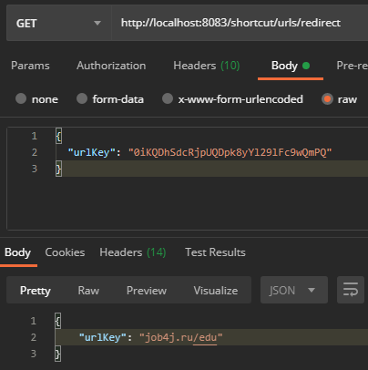
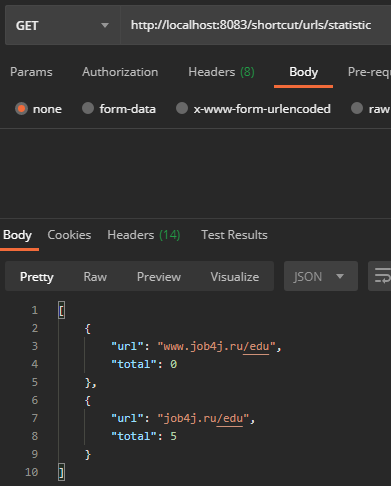

[](https://travis-ci.org/DaniilsLoputevs/job4j_url_shortcut)
# job4j_UrlShortCut

The service allows you to ensure the safety of users on the site by replacing regular links with converted ones.
The project is a service for collecting statistics of page visits for various sites registered in the system. 
This webapp realizes site field with using of principle of RESTfull architecture.

## Basic scheme of app using RESTful architecture


## Used technologies
* Java Core
* JWT
* Rest API
* Spring Boot Security
* Spring Boot Data JPA
* Spring Boot Web
* Spring Boot Tomcat
* Maven
* Travis C.I.


## Use cases
1) This app can be pushed and used with any development environment that supports Java (IntellijIDEA, Eclipse, others).

## Steps of work
After you pushed webapp, you can use it. Steps of work are next:

I. Registration of your site.


II. Login.


III. Convert specific url to unique key. (only with Auth)


IV-I. Decode using unique key. (only with Auth)


IV-II. Redirect using unique key.


V. Get statistic of url visits. (only with Auth)



### REST API
| command                        | request                                                                          | response
|--------------------------------|----------------------------------------------------------------------------------|-------------------------|
| domain registration            | POST ```https://sitename/shortcut/registration/```  Body: ```{"domainUrl": "job4j.ru"}```       | Код состояния:```200```  Header: ```"Content-Type: application/json"```  Body: ```{"originalSite": {"domainUrl": "job4j.ru","login": "g9cU0Gpfjr77QBJb79JeUHfsgs4DN9Mf","password": "gikZjJTBvRcSp9LWUkSp15TRVNgjJCTP"},"registered": true }```|
| get JWT for login&password     | POST ```https://sitename/shortcut/login/```  Body: ```{"login": "asdf","password": "1234"}```   | Код состояния:```200```  Header: ```"Content-Type: application/json"```  Body: ```{"jwtToken": "*your JWT will be here, it's so long for documentaiton, just name it : your JWT*"}```|
| redirect url                   | POST ```https://sitename/shortcut/urls/redirect```  Body: ```{"urlKey": "l9ZNVKOiWjimiABtTL059ocwaO0GcMlh"}```   | Код состояния:```200```  Header: ```"Content-Type: application/json"```  Body: ```{"urlKey": "job4j.ru/edu"}```|

API for requests JWT auth:

| command                        | request                                                                                                   | response                                             |
|--------------------------------|-----------------------------------------------------------------------------------------------------------|----------------------------------------------------|
| encode url                     | POST ```https://sitename/shortcut/urls/```  Body: ```{"url": "job4j.ru/edu"}```                           | Код состояния:```200```  Header: ```"Content-Type: application/json"```  Body: ```{"urlKey": "0iKQDhSdcRjpUQDpk8yYl29lFc9wQmPQ"}```|
| decode url                     | GET  ```https://sitename/shortcut/urls/```  Body: ```{"urlKey": "0iKQDhSdcRjpUQDpk8yYl29lFc9wQmPQ"}```    | Код состояния:```200```  Header: ```"Content-Type: application/json"```  Body: ```{"urlKey": "job4j.ru/edu"}```|
| get statistic                  | GET  ```https://sitename/shortcut/urls/statistic```  Body: ```{"login": "asdf","password": "1234"}```     | Код состояния:```200```  Header: ```"Content-Type: application/json"```  Body: ```[{"url": "job4j.ru/edu","total": 1 }]```|


## Author
Daniils Loputevs